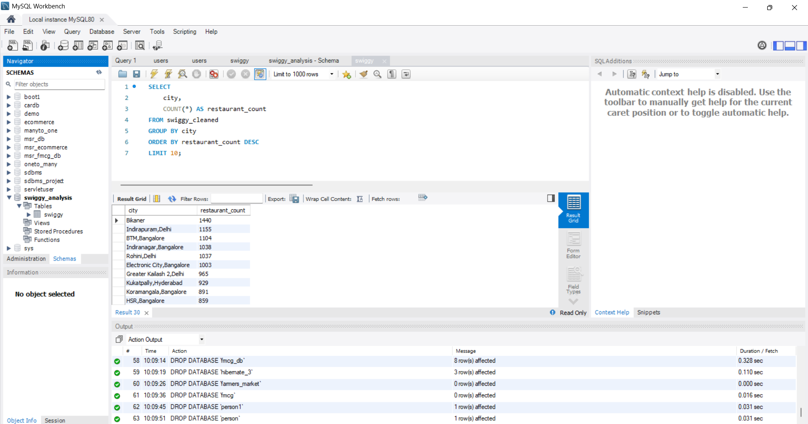
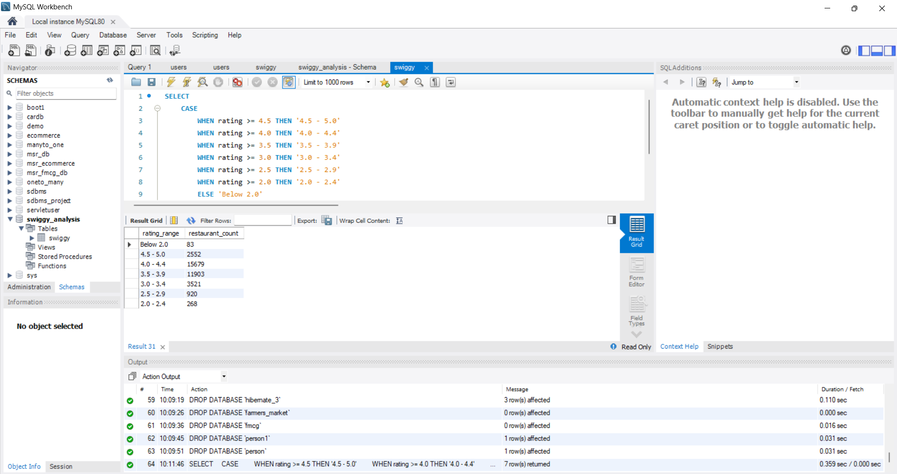
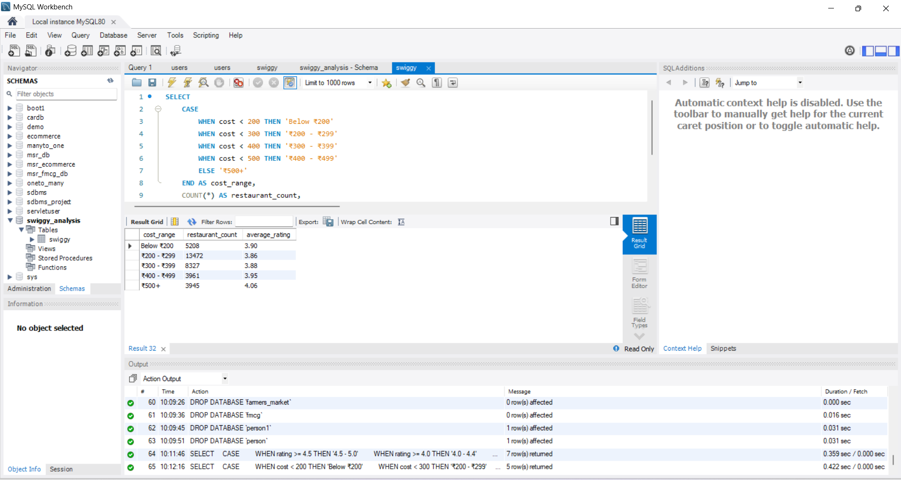

# Swiggy Restaurant Data Analysis — MySQL

## Project Overview

This project analyzes **81,777 Swiggy restaurant records** using MySQL to identify patterns in restaurant locations, cuisine categories, ratings, pricing, and the relationship between cost and rating.

The project demonstrates practical SQL skills including data cleaning, transformation, aggregation, filtering, grouping, and business-oriented analysis.

## Dataset

- **Records:** 81,777 restaurant records
- **Database:** MySQL
- **Raw table:** `swiggy`
- **Cleaned table:** `swiggy_cleaned`

### Main Columns

- Restaurant ID
- Restaurant Name
- Location
- Cuisine
- Rating
- Rating Count
- Cost
- License Number
- Restaurant Link
- Address

## Data Cleaning

The raw restaurant data contained rating and cost values stored as text.

The `swiggy_cleaned` table was created to:

- Convert restaurant ratings into numeric values
- Convert currency-formatted cost values into numeric values
- Handle missing or placeholder rating values
- Preserve the original raw dataset for reference

## SQL Analysis

The project includes analysis of:

1. Restaurant distribution by location
2. Popular cuisine categories and combinations
3. Location-wise average restaurant ratings
4. Highest-cost restaurant records
5. Overall rating distribution
6. Cost ranges compared with average ratings
7. Business insights from the analyzed data

## Key Findings

- **Bikaner** had the highest number of restaurant records among the analyzed locations, with **1,440 records**.
- **Indian** was the most frequently occurring individual cuisine category, with **3,595 records**.
- The highest average location rating in the analysis was **4.22**.
- The largest rating group was **4.0–4.4**, containing **15,679 records**.
- The **₹500+** cost group had the highest average rating among the analyzed cost ranges at **4.06**.
- A recorded cost of **₹300,350** for KOHINOOR HOTEL was identified as a potential data anomaly requiring validation.

> The cost-versus-rating analysis identifies differences between price groups but does not establish that higher cost directly causes higher ratings.

## Results & Visual Evidence

### Restaurant Distribution by Location



### Rating Distribution



### Cost vs Rating Analysis



## Project Structure

```text
Swiggy-SQL-Analysis/
│
├── README.md
├── swiggy_analysis.sql
├── findings.md
├── 01-location-analysis.png
├── 02-rating-distribution.png
└── 03-cost-vs-rating.png

```

## Tools & Technologies

- MySQL
- MySQL Workbench
- SQL
- Git
- GitHub

## Skills Demonstrated

- SQL Data Cleaning
- Data Transformation
- Aggregate Functions
- GROUP BY and HAVING
- Filtering with WHERE
- Sorting and Ranking
- CASE Statements
- Regular Expressions
- Business Data Analysis
- Data Quality Checking

## How to Run

1. Install MySQL and MySQL Workbench.
2. Create a database named `swiggy_analysis`.
3. Import the original Swiggy CSV dataset into a table named `swiggy`.
4. Open `swiggy_analysis.sql` in MySQL Workbench.
5. Run the data-cleaning query to create `swiggy_cleaned`.
6. Run the analysis queries to reproduce the findings.

## Project Files

- `swiggy_analysis.sql` — SQL data cleaning and analysis queries
- `findings.md` — Detailed analysis results and observations
- `README.md` — Project documentation
- `01-location-analysis.png` — Location analysis result
- `02-rating-distribution.png` — Rating distribution result
- `03-cost-vs-rating.png` — Cost vs rating result

## Author

Harshitha C.
Software Developer | Aspiring Data Analyst
